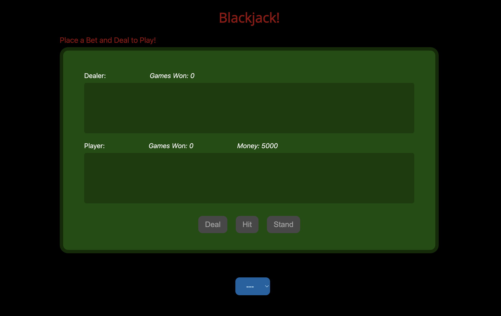
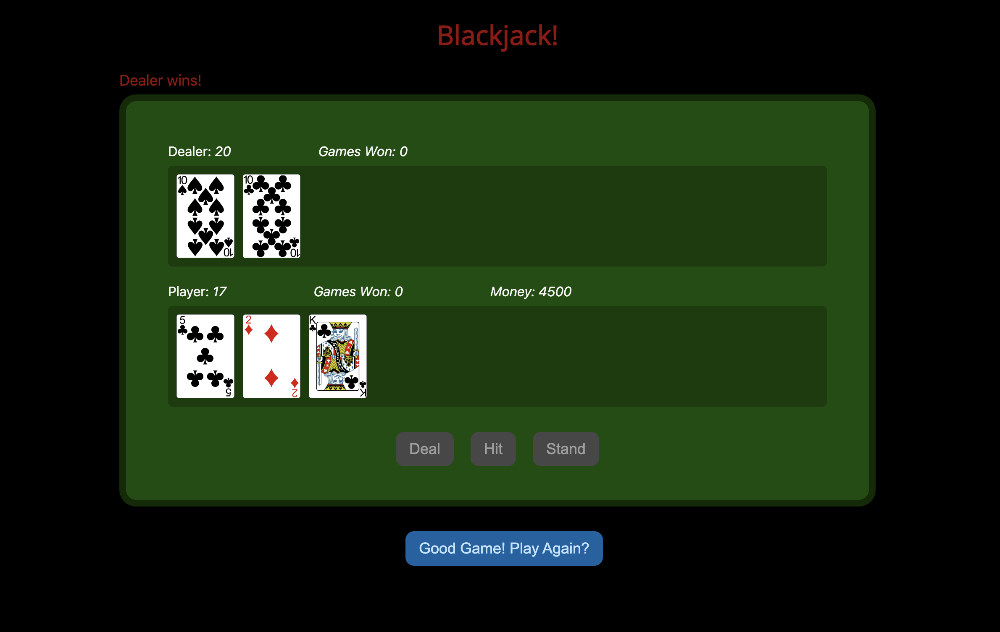
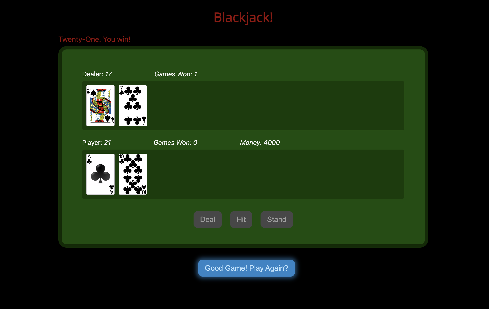

# **BlackJack!**

Blackjack! is a front-end exercise to demonstrate the basics of DOM manipulation.

---

## **Created By**

---

### Blake Lein

Published June 2022

[Email Me](blake.lein@gmail.com) / [GitHub](https://github.com/BlakeLein?tab=repositories)

## Running Blackjack!

---

### **Requirements**

- A web browser.

---

### **Running the Program**

You can clone the dc_work GitHub repo and run the HTML file from the Blackjack directory (in "Projects"). Simply run this file in with your web browser application (Chrome is recommended).

## How Blackjack! Works

---

### Game Play

Blackjack! follows the casino rules of blackjack (without insurance or splits). Players have the opportunity to hit or stand at their discretion before the dealer takes their turn. Whoever has the highest point value without going over 21 wins!

---

### Game Features

Blackjack! highlights the following features:

- Thematic and simple CSS
- A betting system to raise the stakes!
- Continuous count of games won so users can strive for a "longest streak"
- Realistic casino feel and accurate game logic

---

## Blackjack! In Development

Blackjack! combines the minimum functionality of the front-end library to present a clean, fun product. The game is made to be simple, but I have considered the following developments:

- Animations for card movement and the shuffle function
- Time delays for card movement
- Players can choose their card backs
- Utilizing a database for long-term storage of scores and money gains. Players could compete for an "all-time" position on a leaderboard.

## Photos of Blackjack!

