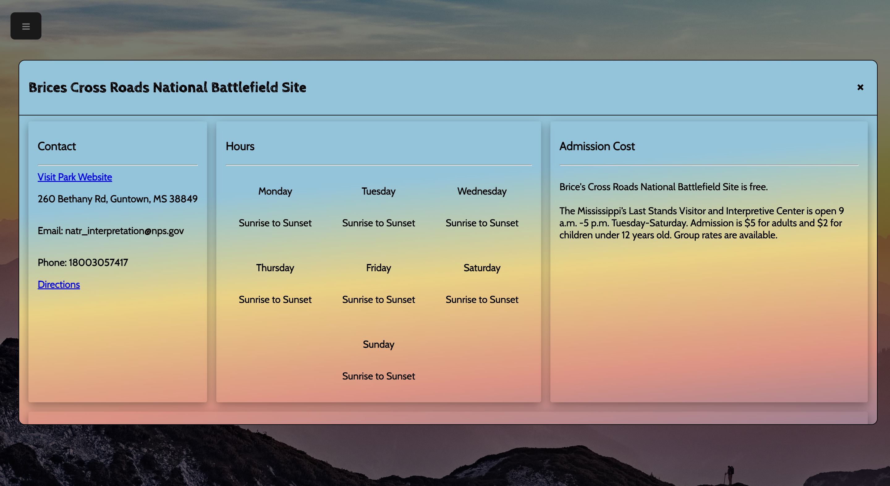
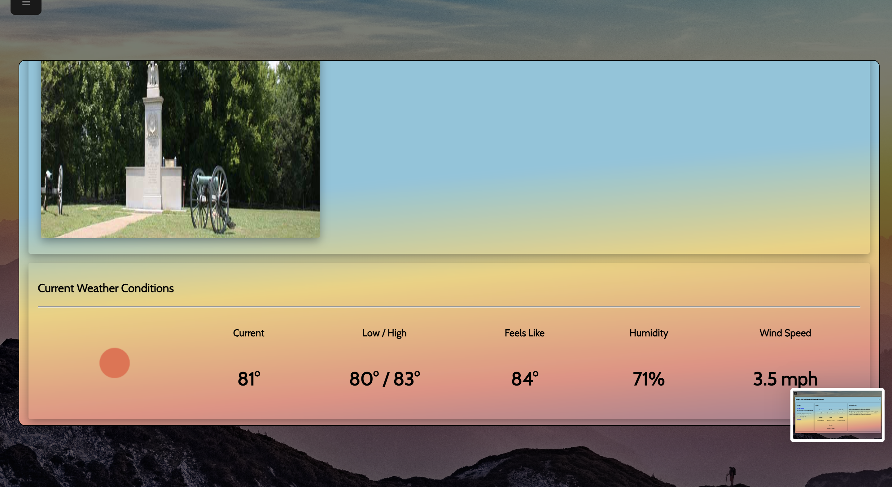

# **_Disover America_**

"Discover America" is a website that allows users to view at a glance and keep track of their favorite US National Parks. "Discover America" utilizes a full front-end code library and demonstrates an understanding of DOM Manipulation and API calling.

---

## **Created By**

---

### Blake Lein

Published July 2022

[Email Me](blake.lein@gmail.com) | [GitHub](https://github.com/BlakeLein?tab=repositories) | [LinkedIn](https://www.linkedin.com/in/blake-lein-bb6187238)

[You can view an article I wrote about the making of this project here](https://medium.com/@blake.lein/discovering-america-discovering-the-dom-e04347039c37)

---

### **Requirements**

- A web browser
- 2 API Keys:
  1. Open Weather API Key (Free - [Found Here](https://openweathermap.org/api))
  2. National Parks Service API (Free - [Found Here](https://www.nps.gov/subjects/developer/index.htm))

**These API Keys will need to be inserted at top of the following JS Files:**

- "allParks.js"
- "fav.js"
- "randomScript.js"

\*\*Simply Download the [Discover America Repo](https://github.com/BlakeLein/dc_work/tree/main/projects/nationalParks), insert your keys, and launch!

## How "Discover America" Works

---

### Wesbite Overview

"Discover America" is a website that utilizes the NPS and Open Weather APIs to provide users with up-to-date information regarding their favorite National Parks and presents it to them in a clean, consistent format. At the click of a button, you can find and view all practical information related to visiting a national park. If it's a park you are particularly interested, you can add the park to your list of favorites, where they will be waiting for you in a separate tab ready to be reviewed.

---

### Website Features

Here are some of the website's features in greater detail:

- Scenic backgrounds from the American countryside
- Clean hide-away navbar
- "Find a Park" page that allows users to search by name or view all parks in a specific state
- "Favorites" page the allows users to keep track of their favorite parks
- "Random Park" page allows users to click a button and receive a random park for a spontaneous adventure or just a fun learning experience!
- "Discover America" is fully responsive for all devices

---

## "Discover America" In Development

This website represents the second major project in our Digital Crafts coursework and demonstates an ability to work with HTML, CSS, Javascript, DOM manipulation, and API implementation.

As with our first project, there are several things that come to mind to expand and improve "Discover America" down the road:

- Creating a "plan-your'trip" feature that allows users to view more information related to actually visiting a national park (road maps, available flights, other attractions, relevent news, etc).
- Including a multi-day weather forecast for each park, not just a current weather forecast.
- A more sophisticated memory storage technique for users to keep track of their favorite parks (this would include a back-end server access).

## Photos of "Discover America"

