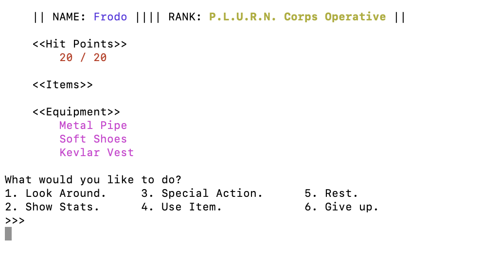

# **P.L.U.R.N.**

P.L.U.R.N. is a python-based adventure game set that makes use of several Object-Oriented Programming techniques. This game is designed to be run on a command line.

---

## **Created By**

---

### Blake Lein

Published June 2022

[Email Me](blake.lein@gmail.com) / [GitHub](https://github.com/BlakeLein?tab=repositories)

[You can view an article I wrote about the making of this project here](https://medium.com/@blake.lein/p-l-u-r-n-ing-to-fly-3ab879e299a1)

## Running P.L.U.R.N.

---

### **Requirements**

- Python 3 (Built on Python 3.10)
- Time module
- Random module

[Click Here](https://realpython.com/installing-python/#how-to-install-from-homebrew) for infomation on downloading Python for your computer.

---

### **Running the Program**

1. Open your computers terminal program and type:

**Mac/Linux users:**

`cd Desktop`

**Windows users:**

`cd C:/Users/username/Desktop`

(Note that "username" will need to be replaced with your computer's username)

2. Ensure that the plurn folder is saved to your computer. You can clone the repository to your Desktop by entering the following text in your command line:

`git clone https://github.com/BlakeLein/dc_work.git`

3. Navigate to the plurn folder by typing:

**Mac/Linux users:**

`cd dc_work/projects/plurn`

**Windows users:**

`cd C:/Users/username/dc_work/projects/plurn`

4. Play the game by opening that folder in your command line and typing:

`python3 plurn.py`

## How P.L.U.R.N. Works

---

### Game Play

P.L.U.R.N. is a game that takes user input to play out a story set in outer space. You are the main character, and you progress the story of the game through prompted and unprompted actions. It is up to you to find your way out of a tough situation!

---

### Game Features

P.L.U.R.N. centers around an exciting narrative that you as the player are meant to follow. Here are some of the game's features:

- Scrolling and color text to make the terminal gaming experience more exciting! ('cprint' function developed by David Boren)
- Ability to choose a unique class
- Ability to collect various items and equipment to help you along
- Engage in combat with dangerous foes
- Ridiculous choices that have (probably) deadly consequences!
- Surviving on... dumb luck.

---

### Winning the Game

**While waiting for text to display, it is important that the player not press any keys prematurely! Please wait for the text to progress at its set pace!**

They game ends when you reach the end of the story. Keep in mind that the story is predetermined, and although you have opportunities to make unique decisions, ultimately all paths lead to the same place.

---

## P.L.U.R.N. In Development

This game has been a blast to work on! This game represents one of the first times in my life I have been able to create something totally from scratch for others to enjoy!

Throughout the process of planning and coding, there are several things that I would like to alter and implement as I progress:

- Creating a more 'open world' concept where players have more freedom to look around and discover new worlds in whatever order they wish.
- Allowing players to have the ability to purchase and upgrade a number of items.
- Allowing players to develop and foster relationships with other non-playable characters.
- A settings module to make the game easily scalable for the desired level of difficulty.

These developments and more are on my mind and may appear in a bigger, better P.L.U.R.N. sequel!

## Photos of Plurn

